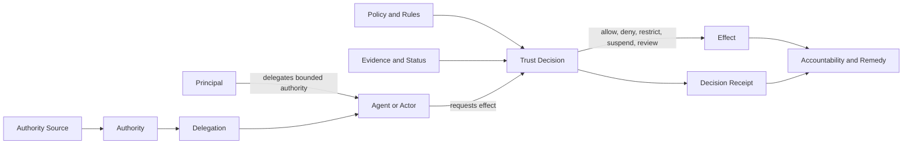
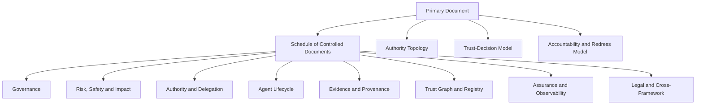
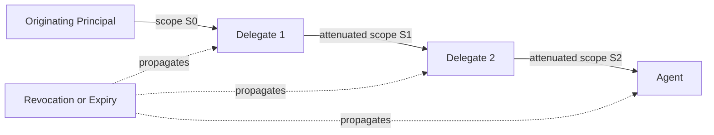
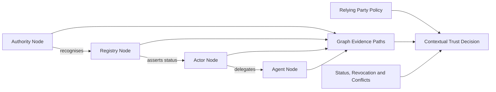

# Architecture Diagrams



These diagrams are informative and use Mermaid syntax.

## 1. Core decision chain



## 2. Governance framework architecture



## 3. Multi-hop delegation



## 4. Runtime governance

```mermaid
sequenceDiagram
  participant Actor
  participant PDP as Governance Decision Service
  participant Registry
  participant Evidence
  participant Tool as Enforcement Point
  Actor->>PDP: Proposed effect + authority context
  PDP->>Registry: Resolve authority, delegation and status
  PDP->>Evidence: Verify evidence and assurance freshness
  PDP->>PDP: Apply policy, risk and impact rules
  alt Allowed
    PDP->>Tool: Permit with constraints and obligations
    Tool-->>PDP: Execution result
  else Review required
    PDP-->>Actor: Route for accountable review
  else Denied
    PDP-->>Actor: Deny with reason code
  end
  PDP->>PDP: Produce decision receipt
```

## 5. Trust graph evaluation



## 6. Governance-event lifecycle

```mermaid
stateDiagram-v0.1.0
  [*] --> Proposed
  Proposed --> Issued
  Issued --> Active: acceptance/activation
  Active --> Suspended: incident or policy trigger
  Suspended --> Active: restoration
  Active --> Revoked: withdrawal
  Active --> Expired: time bound reached
  Revoked --> Archived
  Expired --> Archived
  Suspended --> Revoked
```
