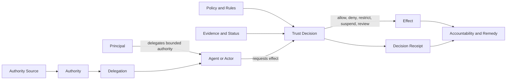
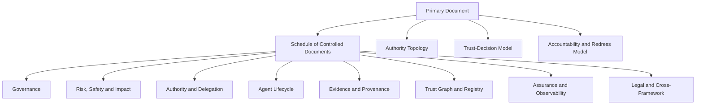
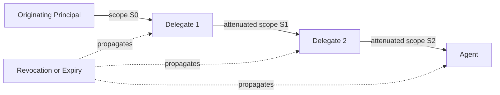
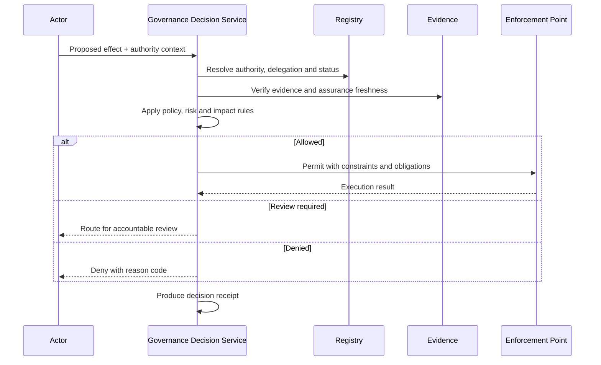
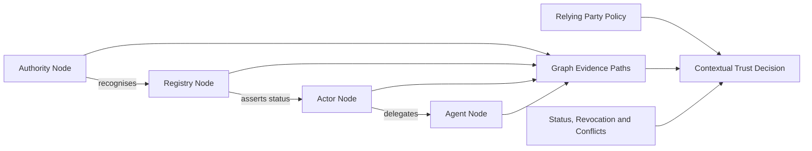
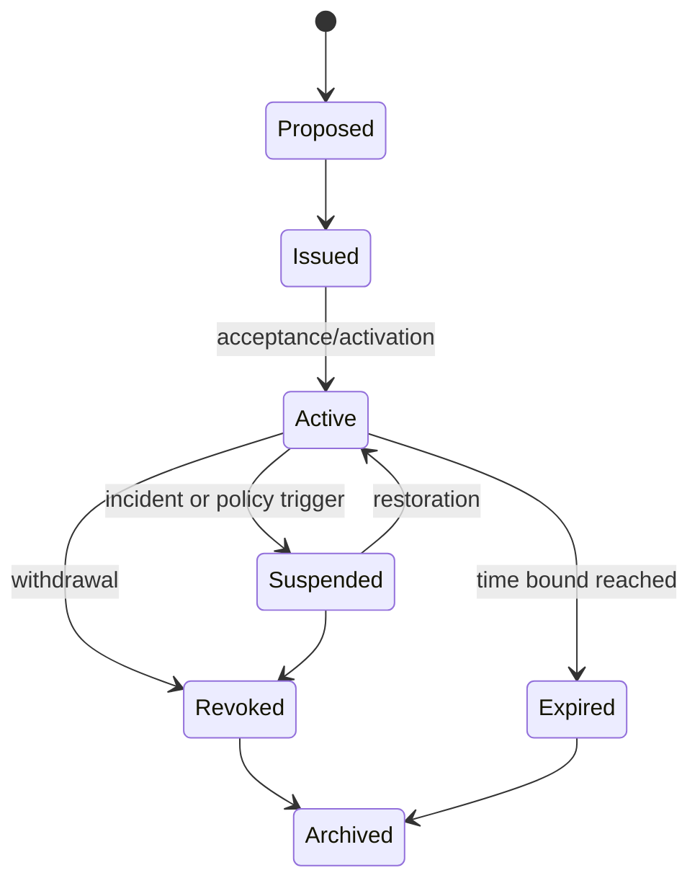
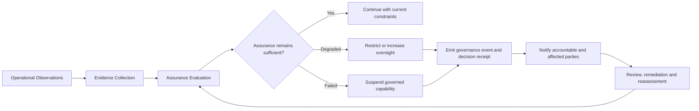
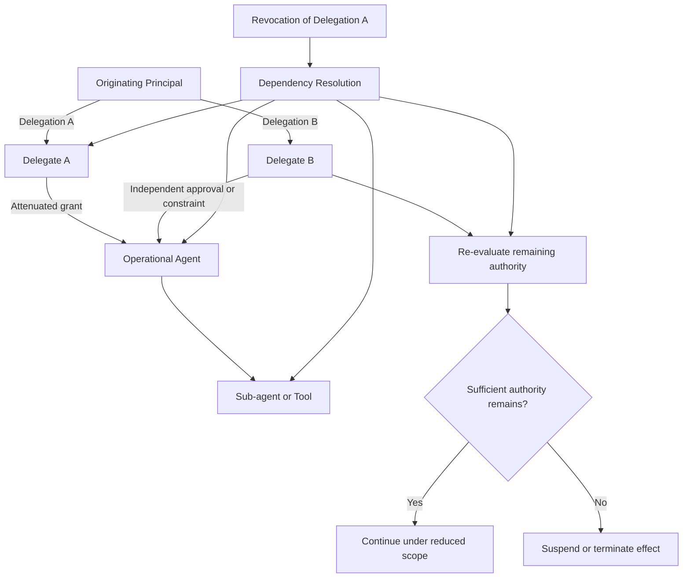
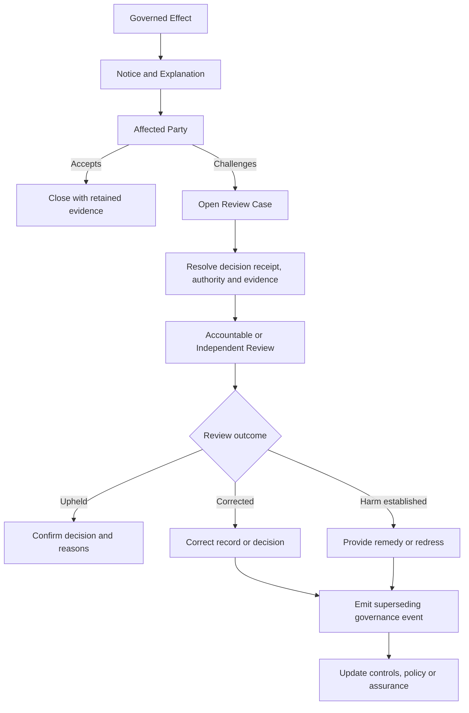
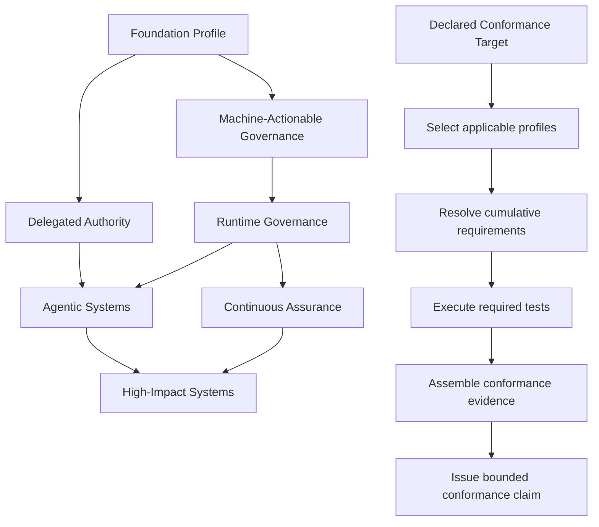

# Architecture Diagrams



These diagrams are informative and use Mermaid syntax.

## 1. Core decision chain

## 2. Governance framework architecture

## 3. Multi-hop delegation

## 4. Runtime governance

## 5. Trust graph evaluation

## 6. Governance-event lifecycle

## 7. Continuous assurance and runtime intervention

This flow shows how operational evidence feeds assurance decisions after an effect has been permitted. It makes restriction, suspension, notification, remediation and reassessment explicit rather than treating assurance as a one-time gate.

**Evidence produced:** observations, assurance evaluations, governance events, decision receipts, notifications and reassessment outcomes.

## 8. Delegation fan-out, convergence and revocation impact

This flow extends the linear delegation model to show independent grants converging on one operational agent and the dependency analysis required when one grant is revoked.

**Evidence produced:** delegation graph, dependency-resolution record, recomputed authority scope and enforcement outcome.

## 9. Contestability, review and remedy lifecycle

This flow places affected-party notice, challenge, evidence resolution, accountable review, correction and remedy inside the governance architecture.

**Evidence produced:** notice, review case, linked decision record, review finding, correction or remedy record and superseding governance event.

## 10. Profile composition and conformance evidence

This flow explains profile dependency closure and the path from a declared conformance target to a bounded, evidence-backed claim.

**Evidence produced:** selected-profile set, resolved requirement set, test results, evidence manifest and bounded conformance claim.
