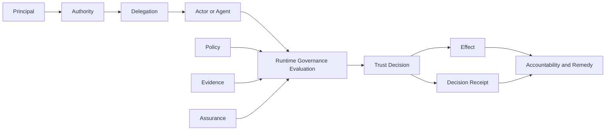

# Architecture Overview



GAAM is an effect-centred governance metamodel. It models how authority, policy, evidence and assurance combine to determine whether a proposed effect may occur and who remains accountable for the result.

## Architectural layers

### Institutional layer

Defines governance authority, applicable context, legal or contractual bases, decision rights, policy ownership, oversight and redress.

### Authority layer

Represents roles, permissions, prohibitions, obligations, constraints and delegation paths. Authority is always bounded and has a source.

### Evidence and assurance layer

Represents claims, evidence, verification, assessment, assurance conclusions, freshness and provenance.

### Decision layer

Evaluates a proposed effect against applicable authority, policy, evidence, context and risk. The result may permit, deny, restrict, suspend or route the effect for review.

### Accountability layer

Preserves decision receipts, governance events, affected-party rights, appeals, remedies and responsibility chains.

## Core flow

## Boundary rule

GAAM defines governance semantics, not protocol mechanics. Implementations may use different identity, credential, registry, policy, graph and agent protocols while remaining conformant, provided they preserve the required semantics and evidence.
