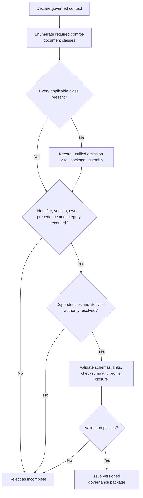
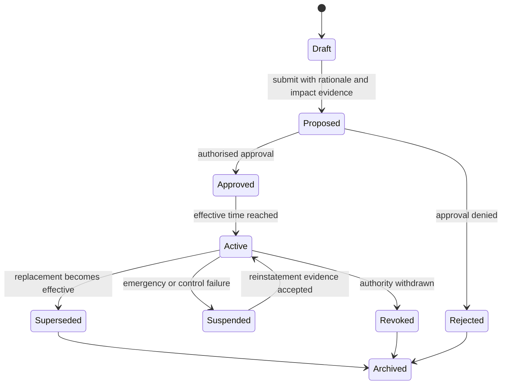

# Governance Control Document Schedule



A GAAM governance package is not complete merely because it contains a policy document. It needs an authoritative, versioned schedule that identifies the documents and machine-readable artifacts which jointly define authority, constraints, evidence, enforcement, accountability and remedy for the governed context.

This schedule is the GAAM equivalent of a controlled-document register. It is deliberately protocol-neutral and does not require decentralized identifiers. Every listed item nevertheless needs a persistent identifier, exact version, integrity evidence, accountable owner and declared precedence.

## Minimum schedule

| Control-document class | Purpose | Minimum contents | GAAM evidence surface |
|---|---|---|---|
| Primary governance instrument | Establish the governed context, purpose, scope and governing authority | Identifier, version, effective date, authority basis, scope, objectives, principles and revision process | Governance package manifest and integrity checksum |
| Authority and delegation policy | Define who may decide, act, delegate, suspend, revoke or supersede authority | Authority sources, grants, delegation limits, depth, attenuation, expiry and revocation rules | Authority and delegation records validated against canonical schemas |
| Roles and accountability policy | Allocate duties, decision rights and accountable ownership | Roles, permissions, prohibitions, separation of duties, escalation and accountable party | Role bindings, decision receipts and governance events |
| Risk and threat assessment | Identify foreseeable failure, misuse and abuse conditions | Risks, affected assets and parties, likelihood, impact, treatment, control owner and residual risk | Threat register and threat-control-test matrix |
| Assurance and evidence policy | Define what evidence is required and how confidence is established | Evidence classes, provenance, freshness, assurance levels, assessors and expiry | Evidence and assurance records plus conformance claims |
| Runtime enforcement policy | Translate governance requirements into enforceable runtime decisions | Preconditions, decision rules, policy precedence, deny or interrupt behavior, safe failure and logging | Runtime envelope, decision receipt and governance-event records |
| Technical interoperability profile | Constrain schemas, protocols, identifiers and testable behavior | Required specifications, profiles, schema versions, vocabularies and compatibility rules | Profile manifest, schema catalog and conformance tests |
| Information governance and security policy | Protect information and system integrity | Confidentiality, integrity, availability, privacy, retention, access control and incident handling | Security controls, evidence records and incident events |
| Inclusion, accessibility and affected-party policy | Define treatment of people and parties affected by governance decisions | Notice, accessibility, non-discrimination, contestability and support channels | Notice, appeal and remedy evidence |
| Legal and commercial instruments | Establish binding obligations where required | Applicable agreements, liability, jurisdiction, service obligations and enforcement mechanisms | References and integrity digests in the package manifest |
| Conformance and assessment plan | Define how implementation claims are tested and bounded | Target of evaluation, profile, tests, evidence level, assessor role and claim limitations | Conformance claim and implementation report |
| Change, suspension and revocation policy | Control the lifecycle of governance artifacts and operative authority | Proposal, approval, effective time, emergency change, suspension, revocation, supersession and archival rules | Governance events, lifecycle states and package versions |
| Appeals, dispute resolution and remedy policy | Provide review and corrective action | Standing, intake, review authority, time limits, interim protection, outcomes and remedy execution | Appeal and remedy records linked to the original decision receipt |

## Required register fields

Each entry in a governance package schedule **MUST** state:

1. a stable document or artifact identifier;
2. the exact version and lifecycle state;
3. the accountable owner and approving authority;
4. the effective date and, where applicable, expiry date;
5. the governed scope and affected profiles;
6. its normative status and precedence relative to other artifacts;
7. a resolvable source location or package-relative path;
8. an integrity digest or a reference to a signed package manifest;
9. the change, suspension and revocation authority; and
10. dependencies, replaced versions and downstream effects.

## Package completeness decision

## Precedence and conflict handling

A package **MUST** define precedence before it becomes operative. A recommended order is:

1. binding law and externally imposed obligations;
2. the primary governance instrument;
3. profile-specific normative requirements;
4. authority, delegation and enforcement policies;
5. assurance, evidence and conformance policies;
6. operational procedures and implementation guidance; and
7. examples and non-normative explanatory material.

Where two artifacts conflict at the same precedence level, the package fails closed until the designated interpretation or change authority records a resolution. Implementations must not silently select the most permissive rule.

## Change and revocation flow

## Conformance boundary

The schedule proves document control and package traceability. It does not by itself prove that an operator follows those documents, that runtime controls are effective, or that an independent assessor has certified the implementation. Those claims require implementation evidence and an explicitly scoped conformance claim.

## Reference context

The concept of an authoritative schedule of controlled documents is also present in the *ToIP Governance Metamodel Specification v1.0* (2021), including categories for glossary, risk, assurance, governance, business, technical, information trust, inclusion and legal instruments. GAAM adopts the useful document-control pattern, but defines its own protocol-neutral classes, integrity requirements, runtime-enforcement linkage and machine-verifiable package evidence. This document does not import ToIP conformance or normative authority into GAAM.
