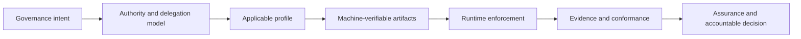

# Guided Learning Paths

GAAM is a concept-to-conformance specification. Readers should first understand the semantic model, then select a profile, implement machine-verifiable artifacts and finally produce evidence against normative requirements. Choose the route aligned to your authority and review role.

## Route 1: policy owner or governance designer

1. [Design principles](design-principles.md)
2. [Architecture overview](architecture-overview.md)
3. [Lifecycle model](lifecycle-model.md)
4. [Architecture diagrams](../diagrams/architecture-diagrams.md)
5. [Implementation patterns](../examples/index.md)

**Completion test:** you can identify the source of authority, delegation scope, enforcement and revocation mechanisms, evidence obligations and accountable assurance decision.

## Route 2: architect, profile author or implementer

1. [Normative specification](../specification/index.md)
2. [Foundation profile](../profiles/foundation-profile.md)
3. [Implementation guide](implementation-guide.md)
4. [Canonical schemas](../schemas/index.md)
5. [Controlled vocabularies](../vocabularies/index.md)
6. [Conformance and assurance](../conformance/index.md)

**Completion test:** each implemented governance claim maps to a normative requirement, canonical structure, enforcement behaviour and testable evidence item.

## Route 3: reviewer, auditor or assurance body

1. [Reviewer guide](reviewer-guide.md)
2. [Normative requirements index](../matrices/normative-requirements-index.md)
3. [Requirement-test coverage](../matrices/requirement-test-coverage.md)
4. [Threat and misuse-case model](../threat-model/README.md)
5. [Threat-control-test matrix](../matrices/threat-control-test-matrix.md)
6. [Conformance matrix](../matrices/conformance-matrix.md)

**Completion test:** the review can reproduce the applicable requirement set, inspect test coverage, locate evidence, identify exceptions and record an accountable disposition.

## Normative reading rule

Informative guidance explains how to apply GAAM but does not replace the normative specification, profiles, schemas or conformance requirements. Record the exact version and profile used whenever making a conformance or assurance claim.

[Continue to the documentation architecture →](documentation-architecture.md)
