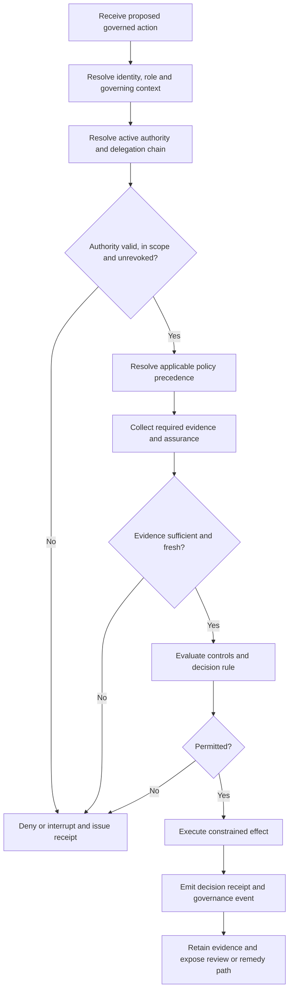

# Implementation Guide

## Implementation sequence

1. Declare the governed context, effects and accountable parties.
2. Create the [governance control document schedule](control-document-schedule.md), then select profiles and resolve dependency closure.
3. Model authority sources, grants, delegations and lifecycle authority.
4. Define policy precedence, evidence, assurance and decision outcomes.
5. Implement runtime enforcement, receipts, interruption and safe failure.
6. Implement affected-party notice, review and remedy.
7. Assemble a versioned governance package and integrity manifest.
8. Run `python scripts/validate.py` and retain generated evidence.

## Control-document baseline

Before implementation, enumerate every applicable governance, authority, risk, assurance, enforcement, information-governance, conformance, change-control and remedy instrument. Record exact versions, owners, precedence, integrity digests and lifecycle authority in the [control document schedule](control-document-schedule.md). A missing or ambiguous controlling artifact is a package defect, not an implementation choice.

## Package structure

Canonical schemas are in [`/schemas`](../schemas/), vocabularies in [`/vocabularies`](../vocabularies/), profile manifests in [`/profiles/manifests`](../profiles/manifests/) and complete patterns in [`/examples`](../examples/).

## Operational rule

A successful schema validation proves structural validity only. Runtime authority, evidence freshness, revocation propagation, accountable enforcement and remedy must also be tested.

## Runtime governance decision flow

