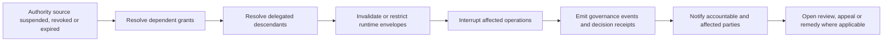

# Governance Artifact Lifecycle Model

GAAM uses explicit state machines for authority, delegation, role assignment, agent identity, evidence, assurance, recognition, packages, decisions, receipts, incidents, appeals and remedies.

## Common states

`draft → proposed → issued → accepted → active → restricted | suspended | revoked | expired | superseded | terminated → archived`

`contested` and `remediated` apply where review and remedy are available. Not every artifact uses every state.

## Transition control

Every transition identifies transition authority, preconditions, evidence, effective time, emitted governance event and effects on dependent artifacts. Invalid or unauthorised transitions fail closed.

## Propagation

Parent authority suspension, revocation and expiry propagate according to the delegation record. Descendant authority cannot remain operative beyond the effective parent authority unless an independently valid authority source is recorded.

## Revocation and dependency propagation

Propagation is evaluated from the authoritative dependency graph. Implementations must preserve the event, effective time, initiating authority and affected descendants as auditable evidence.
