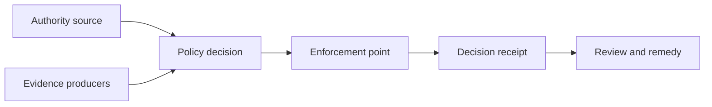

# Architecture and Trust Boundaries
The pattern separates governance authority, policy decision, runtime enforcement, evidence production and review. Trust boundaries exist wherever an actor accepts authority, evidence, state or an effect from another component.

No component may infer missing authority from technical possession or connectivity.
